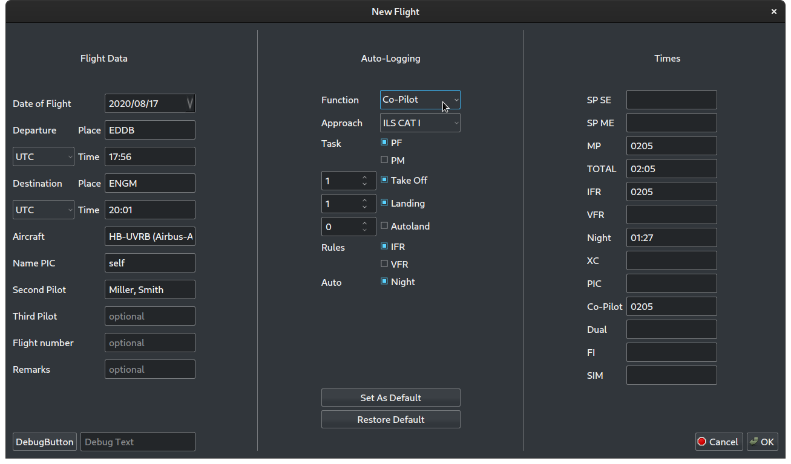
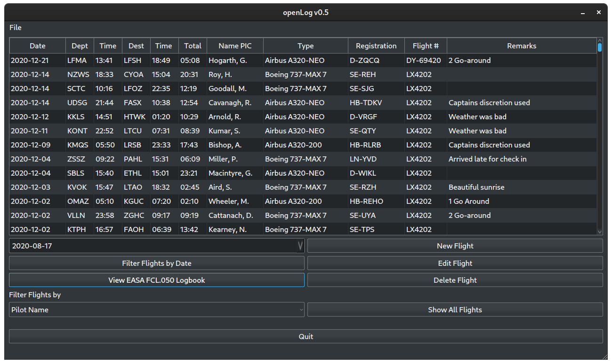

# openPilotLog

Airline pilots are required to maintain a logbook containing details of their flights. These logbooks were historically written by hand on paper, but of course nowadays more and more people are doing it electronically, be it in their own excel sheet or using a professional logbook software.

I have used professional solutions for many years, and have seen more and of them move from being a one-time purchase to becoming a "Logbook as a Service" type subscription. After the one I have been using for the last couple of years, and had bought a "lifetime license" for ended up announcing they also moved to a subscription based service, I decided that I've had enough of it.

As a long-time FOSS enthusiast, I wondered why there wasn't a good open and free alternative available, so I decided to create my own. Since I have used and benefited from free and open source software for a long time, I decided to also create this project as FOSS.

All that being said, while I know how to fly an aircraft, I never properly learned how to code, so if you are a professional programmer and your eyes are bleeding from what you're seeing or I am doing something immensely stupid, please do let me know! This project is my way of learning how to code, so I am more than open to feedback.

# What are the design principles of this program?

Code: C++ (Qt5)

Database: sqlite3

This program is suppposed to replace a paper logbook with an electronic version. As a first step, I want to focus on the basics, and then add 'nice-to-haves' later.
These are the guidelines for this project:
- Speed: openPilotLog is supposed to be fast, lean and efficient. I have settled on using the Qt framework for the gui and code, as well as sqlite for the database.
- Cross-Platform Support: I am primarily using Linux, but Windows and Mac (and maybe down the road iOS/Android) should also be supported. Qt provides this cross-platform compatibility.
- Local: At the moment, I am not planning on implementing a cloud-sync solution. The database is local, on your machine, and moving it around should be as easy as copying it onto a USB stick. While I am not opposed to cloud syncing functionality, I want the application to be independent of external services.

# The state of the project - Should I use this?

Clear answer for the time being - Don't use it. This is an early development stage and functionality, layout of the GUI etc. might change drastically. For this reason, I am not providing a release for now.

# 'x' is a terrible idea, don't do that!

As mentioned before, feedback is welcome and invited! If you know of a better way of doing something, this is an open project so feel free to contribute!

# How does it look like?

Here are some early screenshots:

# But I want to try it!

Well, you have been warned... The most straight forward way is to get a copy of Qt https://www.qt.io/download and compile the project using QtCreator and qmake, the PRO file is included in this repository. After building, make sure to place a copy of the sample database in the application folder (not the source folder). If you want to start a fresh logbook, delete the default database file and rename the empty sample database and place it in the application folder. Without a valid database, the application will not start.
